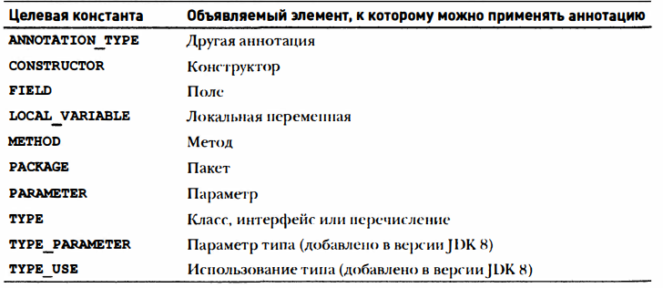

Аннотации (метаданные)
языковое средство, позволяющее встраивать справочную информацию в исходные файлы. Эта информация называется аннотацией и 
не меняет порядок выполнения программы. Это означает, что аннотация сохраняет неизменной семантику программы. Но эта 
информация может быть использована различными инструментальными средствами на стадии разработки или развертывания 
прикладных программ нaJava. Например, аннотация может обрабатываться генераторами исходного кода.

Аннотации создаются с помощью механизма, основанного на интерфейсе.

@interface MyAnno {
String str() ;
int val() ;
}

Все аннотации состоят только из объявлений методов. Но тела этих методов в них не определяются. Вместо этого они 
реализуются средствами Jаvа.

Объявление аннотации не может включать в себя ключевое слово extends . Но все аннотации автоматически расширяют 
интерфейс Annotation. Это означает, что Annotation является суперинтерфейсом для всех аннотаций. Он объявлен в пакете 
java.lang.annotation. В интерфейсе Annotation переопределяются методы hashCode (), equals () и toString () , 
определенные в классе Object. В нем также объявляется метод annotationType (), возвращающий объект типа Class, 
представляющий вызывающую аннотацию. 

Аннотировать можно классы, методы, поля, параметры и константы перечислимого типа. Аннотированной может быть даже сама 
аннотация. Но в любом случае аннотация предшествует остальной части объявления. 

Правила удержания аннотаций
Правила удержания определяют момент, когда аннотация отбрасывается. В Java определены три такие правила, 
инкапсулированные в перечисление
java.lang.annotation.RetentionPolicy. Это правила SOURCE, CLASS и RUNTIME.

Правило удержания аннотации задается с помощью одной из встроенных аннотаций Jаvа: @Retention

RetentionPolicy.SOURCE  – содержатся только в исходном файле и отбрасываются при компиляции
RetentionPolicy.CLASS   – сохраняются в файле с расширением . class во время компиляции. Но они недоступны для виртуальной машины JVM во время выполнения
RetentionPolicy.RUNTIME – сохраняются в файле с расширением . class во время компиляции и остаются доступными для виртуальной машиныJVМ во время выполнения.
Это означает, что правило удержания RUNTIME предоставляет аннотации наиболее высокую степень сохраняемости. 

Если для аннотации не указано никакого правила удержания, то применяется правило удержания CLASS.

Получение аннотаций во время выполнения с помощью рефлексии
Рефлексия- это языковое средство для получения сведений о классе во время выполнения программы. Прикладной программный 
интерфейс (API) для рефлексии входит в состав пакета jаva.lang.reflect.

Для того, чтобы получить метод, у которого имеются параметры, следует задать объекты класса, представляющие типы этих параметров,
в виде аргументов метода

Метод getAnnotations () возвращает массив аннотаций. Этот метод может быть вызван для объектов типа Class, Method, Constructor и Field
Annotation annos [] = ob . getClas s () . getAnnotations ( )

Использование значений по умолчанию
Для членов аннотации можно указать значения по умолчанию, которые будут выбираться при применении аннотации, если для 
них явно не заданы другие значения. Чтобы указать значение по умолчанию, достаточно ввести ключевое слово default в 
объявлении члена аннотации.

@Retention (RetentionPolicy.RUNTIME)
@interface MyAnno {
St ing str () default "Тестирование ";
int val () default 9000;
}

Аннотации-маркеры
Это -специальный вид аннотаций, которые не содержат членов. Единственное назначение аннотации-маркера - пометить 
объявление, для чего достаточно наличия такого маркера, как аннотации. Лучший способ выяснить, присутствует ли в 
прикладном коде аннотация-маркер, - вызвать метод isAnnotationPresent () ,определенный в интерфейсе AnnotatedElement.

Одночленные аннотации
одночленная аннотация состоит из единственного члена. Она действует подобно обычной аннотации, за исключением того, 
что допускает сокращенную форму указания значения члена. Когда в такой аннотации присутствует только один член, 
достаточно задать его значение, а когда она прмиеняется, указывать имя члена необязательно. Член аннотации должен иметь 
имя value.
@ Retention (RetentionPolicy.RUNTIME)
@interface MySingle {
int value() ; // эта переменная должн а иметъ имя value
}
@MySingle(1OO)

Синтаксис одночленных аннотаций можно использовать, и в том случае, когда
применяется аннотация с другими членами, но все остальные члены должны иметь значение по умолчанию

Встроенные аннотации
@Retention Предназначена для применения только в качестве аннотации к другим аннотациям. Она определяет правило удержания.

@Documented служит маркерным интерфейсом, сообщающим инструментальному средству разработки, что аннотация должна быть документирована. Она предназначена
для применения только в качестве аннотации к объявлению другой аннотации

@Target Задает типы элементов, к которым можно применять аннотацию. Она предназначена для применения только в качестве 
аннотации к другим аннотациям. Аннотация @Target принимает один аргумент, который должен быть константой из перечисления 
ElernentType . Этот аргумент задает типы объявляемых элементов, к которым можно применять аннотацию.

В отсутствие обозначения @Target аннотацию можно применять к любому объявляемому элементу, за исключением параметров типов. 
Именно ноэтому зачастую лучше указывать целевые константы явным образом, чтобы ясно обозначить назначение аннотации. 

@Inherited -

@Override - это аннотация, которую можно применять только в методах. С данной аннотацией метод должен быть переопределён из суперкласса.
Если этого не сделать вов ремя компиляции возникнет ошибка. Служит гарантией того, что метод будет переопределён, а не перегружен.

@Dерrесаtеd - маркерная анногация, обозначающая, что объявление устарело и должно быть заменено более новой формой.

@FunctionalInterface - обозначает, что аннотируемый интерфейс является функциональным(содерит только один и только один абстрактный метод)

@SafeVararqs  - Это - аннотация-маркер, применяемая в методах и конструкторах. Она указывает на отсутствие каких-нибудь 
небезопасных действий, связанных с параметром переменной длины. Эта аннотация служит для подавления непроверяемых 
предупреждений, возникающих в коде, который в остальном является безопасным, в связи с применением неовеществляемых 
типов аргументов переменной длины и получением экземпляра параметризированного массива.

@SuppressWarninqs - Эта аннотация обозначает, что следует подавить одно или несколько предупреждений, которые могут быть 
выданы компилятором. Подавляемые предупреждения указываются по имени в строковой форме. 

Типовые аннотации
Например, аннотировать можно тип, возвращаемый методом, тип объекта по ссылке this в теле метода, приведение типов, 
уровни доступа к массиву, наследуемый класс, оператор throws , а также обобщенные типы, включая границы параметров и 
аргументы обобщенного типа

Повторяющиеся аннотации
Позволяют повторять аннотации в одном и том же элементе. Такие аннотации называются повторяющимися. Для того чтобы 
сделать аннотацию повторяющейся, ее следует снабдить аннотацией @RepeataЬle. В ее поле value указывается тип 
коптейперадля повторяющейся аннотации. Такой контейнер указывается в виде аннотации, для которой поле value является 
массивом типа повторяющейся аннотации. Следовательно, чтобы сделать аннотацию повторяющейся, прежде нужно создать 
контейнерную аннотацию, а затем указать ее тип в качестве аргумента аннотации @RepeataЫe. Для доступа к повторяющимся 
аннотациями с помощью такого метода, как, например, ge tAnnotat ion ( ) , следует воспользоваться контейнерной, а не 
самой повторяющейся аннотацией. Именно такой подход и демонстрируется в приведенном ниже примере программы. В этой 
программе представленная ранее версия аннотации MyAnno преобразуется в повторяющуюся аннотацию, а затем демонстрируется 
ее применение.

Некоторые ограничения на аннотации
1) одна аннотация не может наследовать другую. 
2)  все методы, объявленные в аннотации, должны быть без параметров. Кроме того, они должны возвращать один из 
перечисленных ниже типов: 
примитивный тип наподобие int или double;
объект класса String или Class;
перечислимый тип;
тип другой аннотации;
массив одного из предыдущих типов .
3) Аннотации не могут быть обобщенными. Иными словами, они не могут прини·
   мать параметры типа. (Обобщения рассматриваются в главе 14.) 
4) При объявлении методов в аннотациях нельзя указывать оператор throws. 

